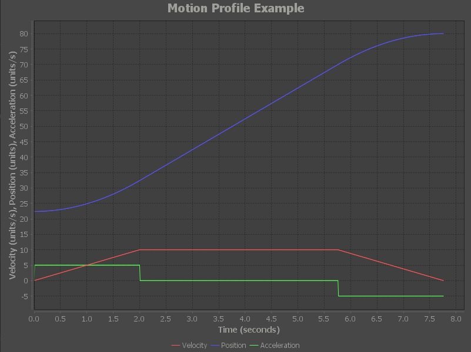

# motion-profile-generator

[](https://jitpack.io/#Mittyrobotics/motion-profile-generator)

Simple motion profile generator for FRC teams.

JavaDocs: https://mittyrobotics.github.io/motion-profile-generator/
## Getting Started
This project can be imported using jitpack.io.

Go to https://jitpack.io/#Mittyrobotics/motion-profile-generator for detailed instructions on how to add this to your project using Gradle, Maven, Sbt, or Leiningen aswell as copy and paste code for the latest version.

<details><summary>Gradle</summary>
Add this to your root build.gradle:
  
```python
allprojects {
 repositories {
		...
		maven { url 'https://jitpack.io' }
	}
}
```
Add the dependency:
```python
dependencies {
    compile 'com.github.Mittyrobotics:motion-profile-generator:ENTER_LATEST_VERSION_HERE'
}
```
Replace ENTER_LATEST_VERSION_HERE with the latest version shown on the badge at the top of the README.
</details>
<details><summary>Maven</summary>
Add the JitPack repository to your build file:
  
```python
<repositories>
	<repository>
		   <id>jitpack.io</id>
		   <url>https://jitpack.io</url>
	</repository>
</repositories>
```
Add the dependency:
```python
<dependency>
	   <groupId>com.github.Mittyrobotics</groupId>
	   <artifactId>motion-profile-generator</artifactId>
	   <version>ENTER_LATEST_VERSION_HERE</version>
</dependency>
  ```
Replace ENTER_LATEST_VERSION_HERE with the latest version shown on the badge at the top of the README.
</details>

## Usage
To create a motion profile:
```java
double acceleration = 5; 		//units/sec^2
double deceleration = 5; 		//units/sec^2
double maxVelocity = 10; 		//units/sec
double startVelocity = 0; 		//units/sec
double endVelocity = 0; 		//units/sec
double lowerPositionBound = 0; 		//units
double upperPositionBound = 124.5; 	//units
double currentPosition = 22.4; 		//units
double setpoint = 80; 			//units

VelocityConstraints velocityConstraints = new VelocityConstraints(
acceleration, 
deceleration, 
maxVelocity, 
startVelocity, 
endVelocity
);  

MechanismBounds mechanismBounds = new MechanismBounds(
currentPosition,
lowerPositionBound,
upperPositionBound
);  

TrapezoidalMotionProfile motionProfile = new TrapezoidalMotionProfile(
setpoint,
velocityConstraints,
mechanismBounds
);
```
VelocityConstraints contain the maximum acceleration, maximum deceleration, maximum velocity, starting velocity, and ending velocity of the motion profile. MechanismBounds contain the current position of the mechanism as the motion profile is instantiated, the mechanism's minimum position bound, and the mechanism's maximum position bound. The TrapezoidalMotionProfile takes in the setpoint, the VelocityConstraints, and the MechanismBounds.

Now that the motion profile is generated, you can get the acceleration, velocity, and position value for an input timestamp using:
```java
double t = 2.43; 				//seconds

MotionFrame frame = motionProfile.getFrameAtTime(t);

double position = frame.getPosition();		//units
double velocity = frame.getVelocity();		//units/sec
double acceleration = frame.getAcceleration();	//units/sec^2
```
Normally, to follow the motion profile you want to loop through the motion profile periodically and get the current position value for the time since you began following the motion profile. 
*FRC Commands and Subsystems tip:* If you are using the FRC commands and subsystems format, commands have a function to get the time since the command began, which comes in handy while following a motion profile:
```java
double t = timeSinceInitialized(); //Time in seconds since the command has been initialized, this is usually the time you would want to get a motion frame from
```
## Visualizing a motion profile
The library has a built in class to allow you to graph a motion profile. This uses JFreeChart to graph the values of the motion profile over time. Simply create a new GraphMotionProfile object and input the desired motion profile to graph as a parameter:
```java
new GraphMotionProfile(motionProfile);
```
Here is the output graph using the demo code above:
<p align="left">
  
</p>
Dark Theme Graphs!
